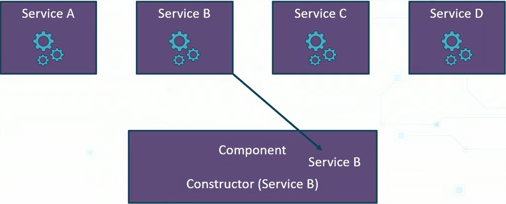
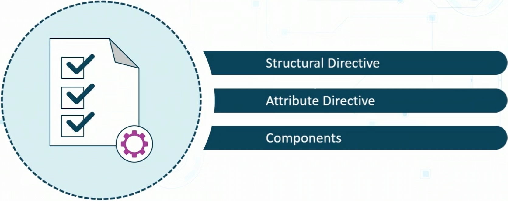

<!-- markdownlint-disable MD025-->
<!-- markdownlint-disable MD041-->

- [Services](#angular-services)
  - [The Workings of Angular Services](#the-workings-of-angular-services)
- [Pipes](#angular-pipes)
- [Directives](#angular-directives)
  - [Types of Directives](#types-of-directives)
    - [Structural](#structural-directive)
    - [Attribute](#attribute-directive)
- [Routing](#angular-routing)

# Angular Services

Angular services are classes that contain common code and data that can be shared across the application.
(i.e., HTTP Client services that allows to make call to API calls). They enhance reusability and modularity.

- A single instance of the service class is created
- Only one object exists for each service that is created
- The service can be shared amongts other services and components
- `@Injectable` decorators are used to define the services
- Services use the injector mechanism
- These injectors are responsible for creating a single object for this service class
- Injectors are used to provide these services to different classes and other services that require this common code data

## The Workings of Angular Services

# Angular Pipes

Pipes are used to transform strings, currency, and dates. They are used in template expressions and they can be used throught the application once declared.

# Angular Directives

Direcetives are used to attach behavior to the DOM elements. They are classes containing `@Directive` decorators.

ex:
`
[ngStyle]="{'color': 'red'}">Font is now Red
`

## Types of Directives

### Structural Directive

- A structural directive is responsible for manipulating, modifying, and removing elements inside a component template
- It updates the structure of the elements to which it is applied

### Attribute Directive

- Changes the behavior of an elements, component, or another directive

# Angular Routing

- Routes are used to navigate a single page application
- Single page applications do not refresh the entire page
- They refresh a certain part of the application
- Component displays for a specific URL
- Data passed to a component while moving from one page to another
  - User is authentication
- Lazy loading possible
  - We only load components or views when needed.
