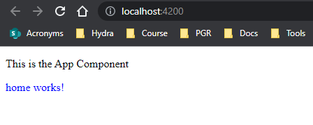

# Adding styleUrls to Angular Components

Once the component is created, the style template (css file) is created. This template is empty.

`home.component.ts`:

```JS
import { Component, OnInit } from '@angular/core'

@Component({
  selector: 'app-home',
  templateUrl: './home.component.html',
  styleUrls: ['./home.component.css']
})
export class HomeComponent implements OnInt {

  constructor() {}

  ngOnInit(): void {}

}
```

`home.component.html`:

```HTML
<div id="demo">
  <p>home works!</p>
</div>
```

`home.component.css`:

```CSS
div#demo {
  color: blue;
}
```

output:


