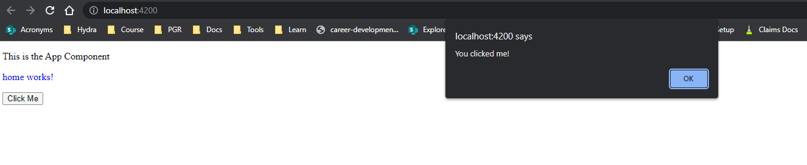
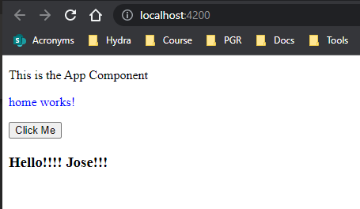

# Data Binding in Angular

The process of connecting/synchronizing data with UI elements. Helps the user to manipulate the elements on the website and defines the interaction between the DOM and the components. It allows one-way and two-way binding.

## Property Binding

Property binding binds a property of a DOM element to the class variable

**Regular HTML:** here the right side of `src` is interpreted by the browser as a location

```HTML

```

**Angular property binding:** the right side is interpreted by a property in the component.

```HTML

```

## Event Binding

It binds to the element's events to a desired function on the `component.ts` file; for example the `click` event

`home.component.ts`:

```JS
onClickEvent() {
  alert("You just clicked me!")
}
```

`home.component.html`:

```HTML
<button type="" (click)="onClickEvent()">click me</button>
```

`output`:



## Data Binding with Interpolation

Data can be bound to the component using interpolation. Returns HTML output from TypeScript code.

`home.component.ts`:

```JS
name: string = "Jose";
```

`home.component.html`:

```HTML
<h3>Hello !!! {{ name }}!!!</h3>
```

`output`:



## Two-Way Binding

We can also do two-way binding when we both set the component's property and also modify the DOM without having to refresh. This is done `[(ngModel)]`. To be able to use this two-way binding we first have to import `FormsModule` from `@angular/core` and append the `imports` array on `app.module.ts` file with it.

`app.module.ts`

```JS
import { NgModule } from '@angular/core';
import { BrowserModule } from '@angular/platform-browser';

import { AppComponent } from './app.component';
import { HomeComponent } from './home/home.component';
import { FormsModule } from '@angular/forms';

@NgModule({
  declarations: [
    AppComponent,
    HomeComponent
  ],
  imports: [
    BrowserModule,
    FormsModule
  ],
  providers: [],
  bootstrap: [AppComponent]
})
export class AppModule { }

```

`home.component.html`

```HTML
<div>
  <input type="text" [(ngModel)]="name">
</div>
```

`output`:

<!-- markdownlint-disable MD033-->


