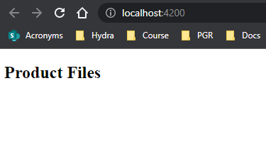

# Bootstrapping Components Using Modules

On `app.module.ts` we are passing to the `NgModule` decorator an object with the key/value pair `bootstrap: [AppComponent]`. This tells angular that the main page to display is the `AppComponent`. If we wanted to change the 'main' page we could change this:

**Displaying `ProductComponent` as main page:**

`app.module.ts`:

```JS
import { NgModule } from '@angular/core';
import { BrowserModule } from '@angular/platform-browser';

import { AppComponent } from './app.component';
import { ProductComponent } from './products/product.component';
import { HomeComponent } from './home/home.component';

@NgModule({
  declarations: [
    AppComponent,
    ProductComponent,
    HomeComponent
  ],
  imports: [
    BrowserModule
  ],
  providers: [],
  bootstrap: [ProductComponent]
})
export class AppModule { }
```

`product.component.ts`:

```JS
import { Component } from '@angular/core';

@Component({
  selector: 'app-product',
  templateUrl: './product.component.html'
})
export class ProductComponent {}
```

`product.component.html`:

```HTML
<h2>Product Files</h2>
```

**We will then have to change the `index.html` file found in the `src/` directory of the application. By default it displays `app.root`, which is the `AppComponent` selector. Change this to `<app-product></app-product>`

`index.html`:

```HTML
<!DOCTYPE html>
<html lang="en">
  <head>
    <meta charset="utf-8" />
    <title>Skills</title>
    <base href="/" />
    <meta name="viewport" content="width=device-width, initial-scale=1" />
    <link rel="icon" type="image/x-icon" href="favicon.ico" />
  </head>
  <body>
    <app-product></app-product>
  </body>
</html>
```


