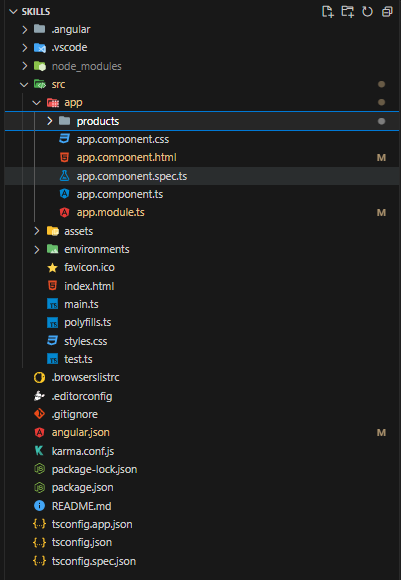
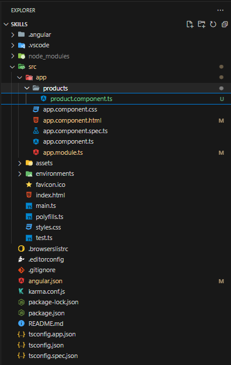
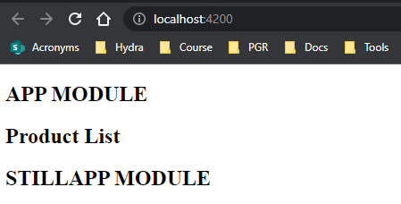

# Creating an Angular Component without CLI

All components are found inside the `src/app` directory of the application and it is good practice to keep all components within their own directories.

## Create Folder

First start by creating a new folder `products` (example) inside `src/app`.



## Create a new file

Inside the new folder create a TypeScript file `product.component.ts`. By convention, all component files are named with `component`.



## Imports

Start by importing `Component` from `@angular/core`:

```JS
import { Component } from `@angular/core`;
```

## Add Decorator

Then add the `@Component` decorator and pass an key/value object with its `selector` and `template` (inline templating) or `templateUrl` (using a external css file). Please note that by convention the selector is prepended with `app-`.

```JS
import { Component } from `@angular/core`;

@Component({
  selector: 'app-product`,
  template: `<h2>Product Files</h2>`
})
```

## Declare and export the class

By convention the class should be named in PascalCase, `ProductComponent`, and it needs to be exported:

```JS
import { Component } from `@angular/core`;

@Component({
  selector: 'app-product`,
  template: `<h2>Product Files</h2>`
})

export class ProductComponent {}
```

## Import and Declare the component

To be able to use the component it first need to be imported and declared on the parent module (AppModule):

```JS
import { NgModule } from '@angular/core';
import { BrowserModule } from '@angular/platform-browser';

import { AppComponent } from './app.component';
import { ProductComponent } from './products/product.component';

@NgModule({
  declarations: [
    AppComponent,
    ProductComponent
  ],
  imports: [
    BrowserModule
  ],
  providers: [],
  bootstrap: [AppComponent]
})
export class AppModule { }
```

## Display the component

Now we can use the newly created component's selector and place it in the `app.component.html` file for display.

`app.component.html`:

```HTML
<h2>APP MODULE</h2>
<app-product></app-product>
<h2>STILLAPP MODULE</h2>
```


