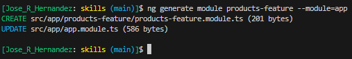
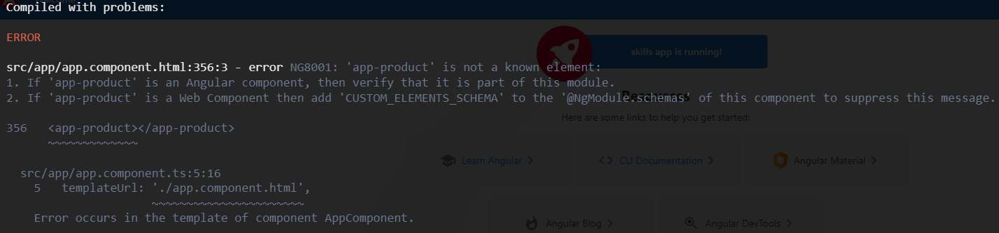

# Create a feature module

```BASH
ng generate module products-feature --module=app
```

>NOTE: `--module=app` does the association and updates the `app.module.ts` file



`products-feature.module.ts` is created inside the new `src/app/products-feature` directory.

```JS
//products-feature.module.ts
import { NgModule } from '@angular/core';
import { CommonModule } from '@angular/common';

@NgModule({
  declarations: [],
  imports: [
    CommonModule
  ]
})
export class ProductsFeatureModule {}
```

`app.module.ts` is also modified, adding the association.

```JS
//app.module.ts
import { NgModule } from '@angular/core';
import { BrowserModule } from '@angular/platform-browser';

import { AppComponent } from './app.component';
import { ProductComponent } from './products/product.component';
import { HomeComponent } from './home/home.component';
import { ProductsFeatureModule } from './products-feature/products-feature.module';

@NgModule({
  declarations: [
    AppComponent,
    ProductComponent,
    HomeComponent
  ],
  imports: [
    BrowserModule,
    ProductsFeatureModule
  ],
  providers: [],
  bootstrap: [AppComponent]
})
export class AppModule { }
```

In this exercise we are placing the `ProductComponent` inside the `ProductsFeatureModule`. All we need to do is just delete the association of `ProductComponent` from `app.module.ts` (delete the import statement and from the declarations array). We then add the import statement and add the component onto the declartions array in the `ProductsFeatureModule`.

```JS
//app.module.ts
import { NgModule } from '@angular/core';
import { BrowserModule } from '@angular/platform-browser';

import { AppComponent } from './app.component';
import { HomeComponent } from './home/home.component';
import { ProductsFeatureModule } from './products-feature/products-feature.module';

@NgModule({
  declarations: [
    AppComponent,
    HomeComponent
  ],
  imports: [
    BrowserModule,
    ProductsFeatureModule
  ],
  providers: [],
  bootstrap: [AppComponent]
})
export class AppModule { }
```

```JS
//products-feature.module.ts
import { NgModule } from '@angular/core';
import { CommonModule } from '@angular/common';
import { ProductComponent } from '../products/product.component';


@NgModule({
  declarations: [
    ProductComponent
  ],
  imports: [
    CommonModule
  ]
})
export class ProductsFeatureModule { }
```

At this moment the application does not compile. This is because it does not recognize `app-product` as a known element.



This is because we have to **export** the component from `ProductsFeatureModule` to the rest of the application.

```JS
//product-feature.module.ts
import { NgModule } from '@angular/core';
import { CommonModule } from '@angular/common';
import { ProductComponent } from '../products/product.component';


@NgModule({
  declarations: [
    ProductComponent
  ],
  imports: [
    CommonModule
  ],
  exports: [
    ProductComponent
  ]
})
export class ProductsFeatureModule { }
```

With this done the application is back to a working state!
