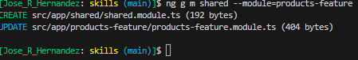

# Creating Shared Modules

## Why?

There are lots of feature of Angular that you want to inside a shared module and share only once. You put all the *common* modules that you'd need inside the shared module and import the shared module instead.

## How?

```BASH
ng g m shared --module=products-feature
```

>NOTE: `--module=products-feature` sets the association between the shared module and the desired module.



This command creates `shared` directory inside the `src/app` folder and imported it to the `products-feature.module.ts` file.

```JS
//products-feature.module.ts
import { NgModule } from '@angular/core';
import { CommonModule } from '@angular/common';
import { ProductComponent } from '../products/product.component';
import { SharedModule } from '../shared/shared.module';


@NgModule({
  declarations: [
    ProductComponent
  ],
  imports: [
    CommonModule,
    SharedModule
  ],
  exports: [
    ProductComponent
  ]
})
export class ProductsFeatureModule { }
```

```JS
// src/app/shared/shared.module.ts
import { NgModule } from '@angular/core';
import { CommonModule } from '@angular/common';


@NgModule({
  declarations: [],
  imports: [
    CommonModule
  ]
})
export class SharedModule { }
```

Notice how `CommonModule` is being used in two different places (the shared and products-feature modules). Delete the *duplicate* import on `products-feature` module for `CommonModule` since it is being imported by the `SharedModule` module.

```JS
// products-feature.module.ts
import { NgModule } from '@angular/core';
import { ProductComponent } from '../products/product.component';
import { SharedModule } from '../shared/shared.module';

@NgModule({
  declarations: [
    ProductComponent
  ],
  imports: [
    SharedModule
  ],
  exports: [
    ProductComponent
  ]
})
export class ProductsFeatureModule { }
```

For the `CommonModule` to be properly imported to the `products-feature` module we have to **export** it from the `SharedModule` module.

>Note: Since we are not using the `CommonModule` on the `SharedModule` we can delete it from the *imports* array.

```JS
//shared.module.ts
import { NgModule } from '@angular/core';
import { CommonModule } from '@angular/common';

@NgModule({
  declarations: [],
  imports: [],
  exports: [
    CommonModule
  ]
})
export class SharedModule {}
```

```HTML
<!-- product.component.html -->
<h2>Product Files</h2>
<div *ngIf="showDiv">Product 1</div>
```

```JS
// product.component.ts
import { Component } from '@angular/core';

@Component({
  selector: 'app-product',
  templateUrl: './product.component.html',
  styles: ['div {font-weight: bolder; color:darkgreen;}'],
})
export class ProductComponent {
  showDiv = true;
}
```

>Note: `*ngIf` is part of the `CommonModule`

Notice how the application now shows the content of the `div` to the DOM.
