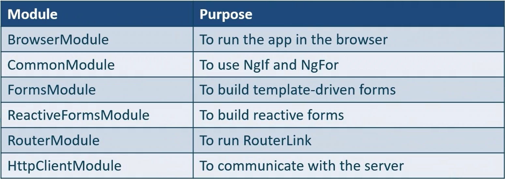

# Explore Third-Party Modules like BrowserModule

## Modules that come with an Angular application

Angular is a front-end web based application development platform. The most **important** module is the `BrowserModule` which allows our application to run in a browser. Another important module is the `CommonModule` which allows us use structural directives. `HttpCLientModule` is used to interact with a server/internet.

## BrowserModule

- Enables/helps to launch the app in a browser
- Exports necessary infrastructure for Angular Apps
- By default, included in Angular apps that are created using CLIs.
- Re-exports CommonModule and ApplicationModule
