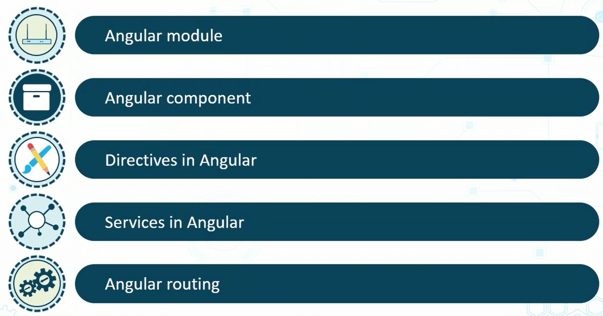
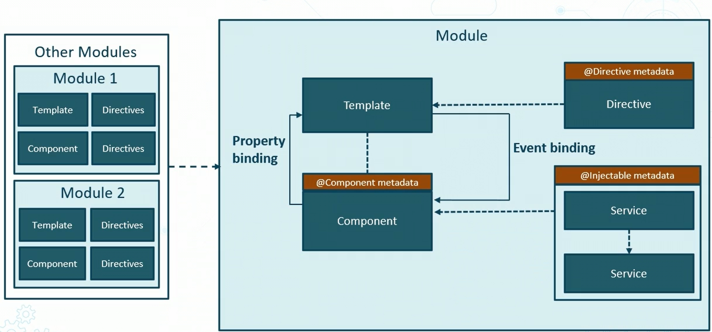

<!-- markdownlint-disable MD041-->

- [Anatomy of an Angular application](#anatomy-of-an-angular-application)
- [The Architecture of an Angular application](#the-architecture-of-angular-application)
- [Angular Module](#angular-module)
  - [Characteristics of an Angular Module](#characteristics-of-an-angular-module)
- [Angular Components](#angular-components)

# Anatomy of an Angular application

# The Architecture of Angular application

# Angular Module

- An Angular module is a container that binds other components together
- It is a collection of closely-related sets of capabilities
- Each module can have further sub-components

## Characteristics of an Angular Module

- An Angular application can have multiple modules
- The application always has one main module
- The could be other modules in the application:
  - Domain module
  - Shared module

# Angular Components

- Components define the visual aspect
- Contain the HTML along with styles and other business logic
  - i.e., `.html`, `.spec.ts`, `component.ts`, `.css` files
- Can define the actions the user can perform within the component
