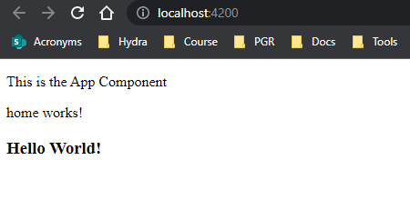

# Adding Templates to Angular Components

Using templates in the components. Upon creating a new component using the CLI command `ng generate component [name]` a default template file is created. However, we can bypass that html file by adding the template directly to the `component.ts` file.

**current state of `home.component.ts`**: `templateUrl` property is pointing to the created html file.

```JS
import { Component, OnInit } from '@angular/core'

@Component({
  selector: 'app-home',
  templateUrl: './home.component.html',
  styleUrls: ['./home.component.css']
})
export class HomeComponent implements OnInt {

  constructor() {}

  ngOnInit(): void {}

}
```

**inline templating:** change the property from `templateUrl` (which expects a file) to `template` and using backticks **`**

```JS
import { Component, OnInit } from '@angular/core'

@Component({
  selector: 'app-home',
  template: `
    <p>home works!</p>
    <h3>Hello World!</h3>
  `
  styleUrls: ['./home.component.css']
})
export class HomeComponent implements OnInt {

  constructor() {}

  ngOnInit(): void {}

}
```

output:

