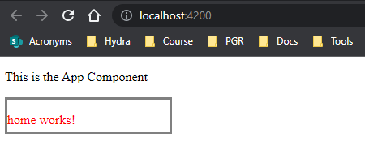

# Working with Sytles in Angular Components

Use could inline styles instead of a physical css file.

**current state:** Using a physical css file; `styleUrls` expect an array of style files (css):

```JS
import { Component, OnInit } from '@angular/core'

@Component({
  selector: 'app-home',
  templateUrl: './home.component.html',
  styleUrls: ['./home.component.css']
})
export class HomeComponent implements OnInt {

  constructor() {}

  ngOnInit(): void {}

}
```

**inline-styles:** replacing `styleUrls` property to `styles`, which expects an array of the wanting styles (using the html/css syntax)

`home.component.html`:

```HTML
<div id="demo">
  <p>home works!</p>
</div>
```

`home.component.ts`:

```JS
import { Component, OnInit } from '@angular/core';

@Component({
  selector: 'app-home',
  templateUrl: './home.component.html',
  styles: [
    `div#demo {
      color: red;
      border-style: solid;
      border-color: grey;
      width: 200px;
      height: 40px;
    }`,
  ],
})
export class HomeComponent implements OnInit {
  constructor() {}

  ngOnInit(): void {}
}
```

output:

